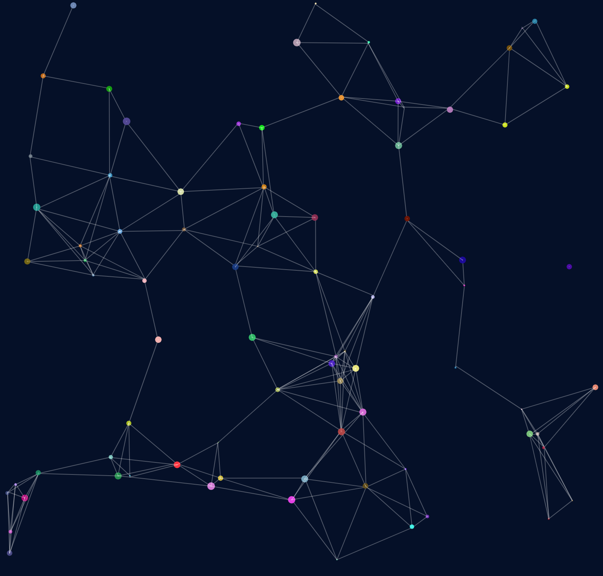

# WWC London the Chrismas Coding Challenge 2022

At least 1 hour of coding practice every day for the 25 days leading to Christmas.
[WWC Event Link](https://www.meetup.com/Women-Who-Code-London/events/289929952/)

[Example - Day 3 Challenge "Particles"](https://ushisha.github.io/WWC-the-christmas-coding-challenge/)

